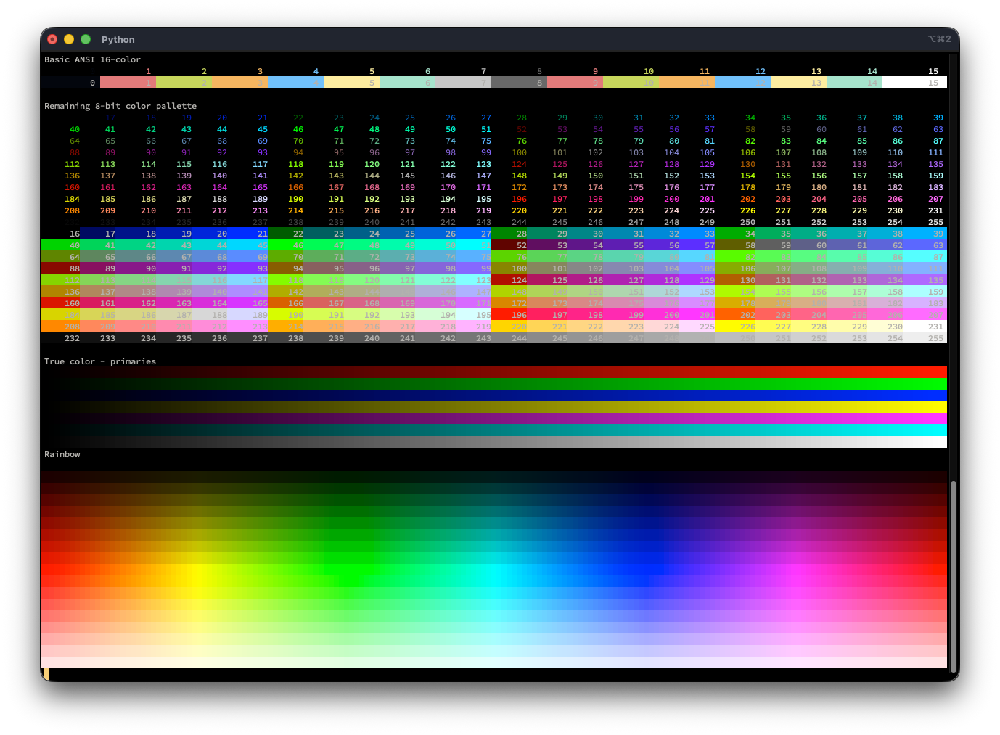

# ANSI color "test chart"
## Verify your terminal emulator's support for ANSI colors

Just prints a pile of colors on a terminal, so you can see if the ANSI 16-,
256-, or true-color escape sequences are working, or can pick a nice
combination foreground/background that works for your terminal/monitor

The output should look similar to what's captured in

...assuming your terminal properly supports ANSI color escapes.
